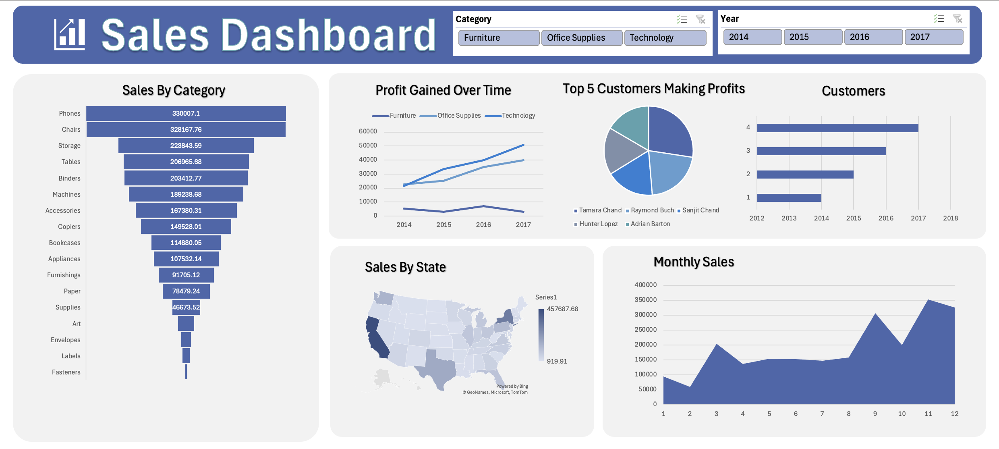

# 📊 Sales Dashboard (Excel)

This project is an **interactive Sales Dashboard** built in Microsoft Excel.  
It allows users to analyze sales performance by **Category, Year, State, and Customers** using slicers and visualizations.

---

## 🔹 Dashboard Preview

---

## 🔹 Features
- Funnel chart showing **Sales by Category**
- Line chart of **Profit Gained Over Time**
- Pie chart of **Top 5 Customers Making Profits**
- Map of **Sales by State**
- **Monthly Sales** trend
- Interactive **Slicers** for Category and Year

---

## 🔹 Tools Used
- Microsoft Excel  
- Slicers, PivotTables, Charts, Conditional Formatting  

---

## 🔹 How to Use
1. Download the file: [Sales_Dashboard.xlsx](Sales_Dashboard.xlsx)  
2. Open in **Microsoft Excel (desktop)**.  
3. Use the **slicers** at the top to filter by Category and Year.  

---

## 🔹 About
Prepared by **Nazish Khalid**  
Date: September 2025
